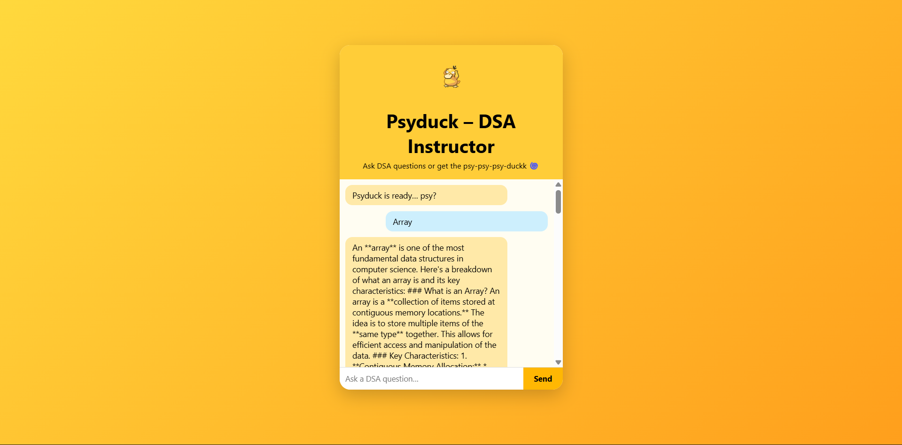

# PSyduck – DSA Instructor 🦆

A fun and interactive chatbot that answers **DSA questions** using an AI API and responds with random `psy-psy-psyduckk!` for non-DSA questions.  
Built with **HTML, CSS, JS** for the frontend and **Node.js** backend for AI integration.

---

## Demo Screenshot

  

---

## Project Link

https://psyduck-dsa-instructor.onrender.com/

---

## Features

- 🧠 **DSA Questions** → Uses AI to provide answers.  
- 🦆 **Non-DSA Questions** → Random `psy-psy-psyduckk!` responses.  
- Fun **Psyduck-themed UI**.  
- Easy to set up and run locally.

---

## Setup Instructions

### 1️⃣ Clone the repository

```bash
git clone https://github.com/YOUR_USERNAME/PSyduck-DSA-Instructor.git
cd PSyduck-DSA-Instructor
cp .env.example .env
API_KEY=YOUR_GOOGLE_GENAI_API_KEY
node server.js
npx serve .
Usage
```
Type DSA questions → Psyduck AI answers using your API.

Type non-DSA questions → Psyduck responds with random psy-psy-psyduckk!.


PSyduck-DSA-Instructor/
├─ index.html        # Frontend HTML
├─ style.css         # CSS styling
├─ script.js         # Frontend JS
├─ server.js         # Node backend server
├─ dsa.js            # AI API logic
├─ .env.example      # Example env file (API key)
└─ .gitignore        # Ignored files (node_modules, .env)


Enjoy chatting with Psyduck! 🦆
